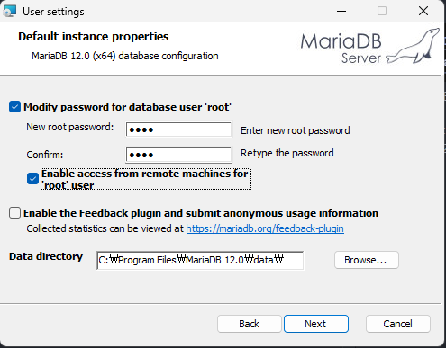
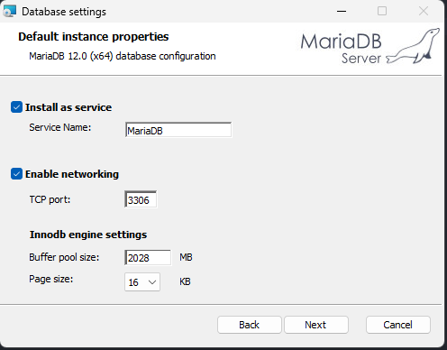
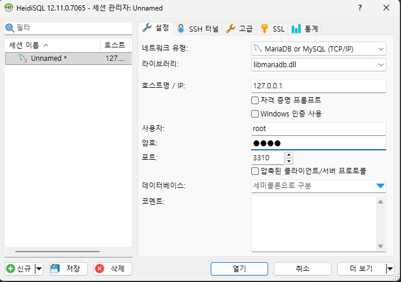

# 금일 수업 계획
1. MariaDB 설치
2. HeidiSQL 조작
3. SQL문 기초

# MariaDB 설치 과정(windows version)
chrome → Mariadb 검색 → Download
https://mariadb.org/

MariaDB Server 12.0.2 Rolling

id : root  
pwd : 1234

1234
1234
root check

PORT : 3306 / 수업 중 : 3310

mariaDB만 설정을 했는데 
window + heidiSQL

암호 1234 입력 / PORT Num : 3310

깃허브 열어서 새 repository 작성하겠습니다.  
korit_07_sql

Ctrl + Shift + ` : 터미널
git init
git config user.name "seomoonjeong"
git config user.email "slow.seo4612@gmail.com"

git add .
